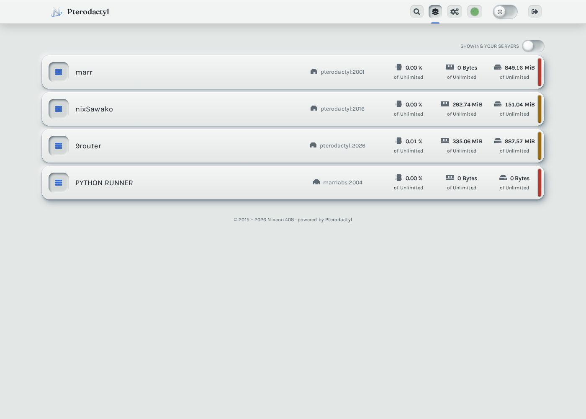
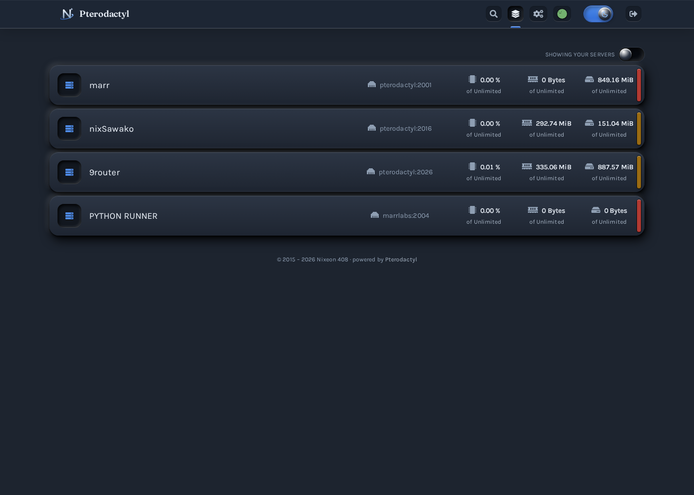
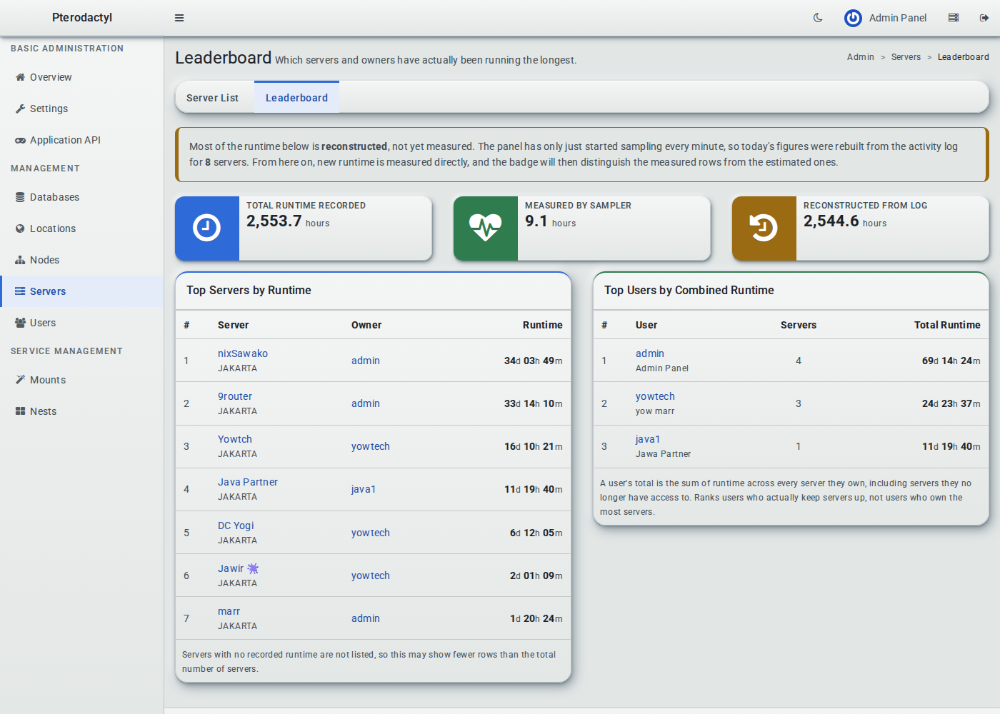
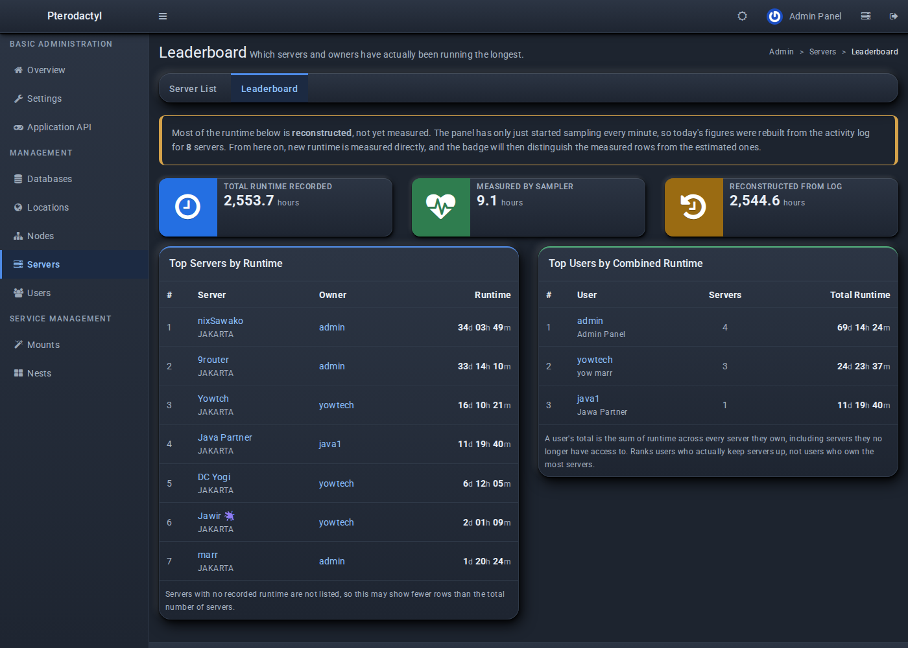

<div align="center">

# ⬢ Nixeon 408

**A full re-skin for Pterodactyl Panel — front-end and admin — with a runtime leaderboard.**

[](https://pterodactyl.io)
[](https://ubuntu.com)
[](https://php.net)
[](LICENSE)

[Fitur](#-fitur) · [Screenshot](#-screenshot) · [Instalasi](#-instalasi) · [Rollback](#-rollback-manual) · [FAQ](#-faq)

</div>

---

## ✨ Fitur

<table>
<tr>
<td width="50%" valign="top">

**🎨 Tema menyeluruh**
- Re-skin panel React **dan** area admin AdminLTE
- Tema terang & gelap, satu toggle, tersimpan per-browser
- Tipografi Fraunces + Karla (panel), Roboto (admin)
- Fisika permukaan (raised / sunken) dari satu sumber cahaya

</td>
<td width="50%" valign="top">

**📊 Runtime Leaderboard**
- **Top Server** — dihitung dari runtime nyata, bukan perkiraan
- **Top User** — total runtime semua server milik user
- Sampling otomatis tiap menit + rekonstruksi histori dari log
- Angka estimasi ditandai jelas, bukan disembunyikan

</td>
</tr>
<tr>
<td valign="top">

**🔒 Aman & bisa dibalik**
- Backup otomatis sebelum menimpa apa pun
- Prosedur rollback manual terdokumentasi (lihat README)
- Tidak menyentuh database selain 1 tabel baru
- React panel asli tidak dimodifikasi strukturnya

</td>
<td valign="top">

**⚡ Instalasi sekali jalan**
- Satu perintah, tanpa Node.js di server target
- Bundle front-end sudah ter-build
- Deteksi otomatis lokasi panel & versi PHP
- Verifikasi 10 titik setelah instalasi

</td>
</tr>
</table>

---

## 📸 Screenshot

<div align="center">

| Panel (terang) | Panel (gelap) |
|:---:|:---:|
|  |  |

| Leaderboard (terang) | Leaderboard (gelap) |
|:---:|:---:|
|  |  |

</div>

---

## 📋 Prasyarat

| Kebutuhan | Detail |
|---|---|
| **OS** | Ubuntu 20.04 / 22.04 / 24.04 (Debian 11+ kemungkinan jalan) |
| **Panel** | Pterodactyl **1.15.x** (versi lain: cek dulu, lihat FAQ) |
| **PHP** | 8.1 atau lebih baru (8.3 disarankan) |
| **Akses** | root / `sudo` |
| **Node.js** | **tidak perlu** — bundle sudah ter-build |

> Panel harus sudah terinstal dan berjalan. Tema ini tidak menginstal Pterodactyl.

---

## 🚀 Instalasi

### Langkah 1 — Login ke VPS

```bash
ssh root@IP_SERVER_KAMU
```

### Langkah 2 — Jalankan installer

```bash
bash <(curl -fsSL https://raw.githubusercontent.com/marrspace/nix-theme-panel/main/install.sh)
```

Installer akan:

1. Memeriksa akses root, PHP, dan lokasi panel
2. **Membackup** semua file yang akan ditimpa
3. Menyalin tema (365 file)
4. Menjalankan migrasi tabel leaderboard
5. Membersihkan cache & me-restart queue worker
6. Memverifikasi hasilnya

### Langkah 3 — Hard refresh browser

Tekan <kbd>Ctrl</kbd>+<kbd>Shift</kbd>+<kbd>R</kbd> (atau <kbd>Cmd</kbd>+<kbd>Shift</kbd>+<kbd>R</kbd>).
Tema disimpan di `localStorage` per-browser, jadi tiap orang bisa pilih terang/gelap sendiri lewat ikon bulan/matahari di kanan atas.

### Selesai

- Panel: `https://panel-kamu/`
- Admin: `https://panel-kamu/admin`
- Leaderboard: `https://panel-kamu/admin/servers/leaderboard`

---

## ↩️ Rollback manual

Installer otomatis membackup file aslimu sebelum menimpa apa pun. Kalau ingin kembali:

**1. Pulihkan file asli dari backup** (path dicetak di akhir instalasi):

```bash
sudo tar --overwrite -xzf backups/pterodactyl-original-<STAMP>.tar.gz -C /var/www/pterodactyl
```

**2. Hapus file yang ditambahkan tema** (tidak ada di backup karena dulu belum ada):

```bash
cd /var/www/pterodactyl
rm -f public/themes/pterodactyl/css/nixeon-admin.css \
      public/themes/pterodactyl/css/nixeon-tokens.css \
      resources/views/admin/servers/leaderboard.blade.php \
      resources/views/partials/admin/servers/tabs.blade.php \
      app/Models/ServerRuntimeTotal.php \
      app/Http/Controllers/Admin/Servers/ServerLeaderboardController.php \
      app/Console/Commands/Maintenance/SampleServerRuntimeCommand.php \
      app/Console/Commands/Maintenance/BackfillServerRuntimeCommand.php \
      database/migrations/2026_10_07_100000_create_server_runtime_totals_table.php
rm -f public/themes/pterodactyl/fonts/roboto-*.woff2
```

> Untuk daftar lengkap file baru, jalankan `diff -rq nixeon /var/www/pterodactyl` sebelum rollback — setiap file yang hanya ada di `nixeon/` adalah file yang ditambahkan tema.

**3. Bersihkan cache:**

```bash
sudo -u www-data php /var/www/pterodactyl/artisan view:clear
sudo -u www-data php /var/www/pterodactyl/artisan config:clear
sudo -u www-data php /var/www/pterodactyl/artisan cache:clear
```

**4. (Opsional) Hapus tabel leaderboard** — hanya kalau kamu tidak butuh datanya:

```bash
mysql -u USER -p DBNAME -e 'DROP TABLE server_runtime_totals;'
```

---

## 📦 Instalasi manual (opsional)

Kalau kamu tidak mau menjalankan script dari internet:

```bash
git clone https://github.com/marrspace/nix-theme-panel.git
cd nix-theme-panel
sudo bash install.sh
```

Isi repo:

```
nix-theme-panel/
├── install.sh          # installer
├── build-payload.sh    # merakit folder nixeon/ dari source tree
├── nixeon/             # payload: semua file yang akan dipasang
└── docs/               # screenshot
```

`install.sh` **harus dijalankan dari root repo** karena membaca folder `nixeon/`.

---

## 🛠️ Kustomisasi

Mau ubah warna/font? Edit `nixeon/resources/scripts/assets/css/tokens.css` — semua warna, radius, dan bayangan ada di situ sebagai custom property. Lalu build ulang:

```bash
cd nixeon
yarn install
yarn run build
```

Hasil build masuk ke `nixeon/public/assets/`. Jalankan `install.sh` lagi untuk memasangnya.

---

## ❓ FAQ

<details>
<summary><b>Panel saya versinya bukan 1.15.x, aman?</b></summary>

Installer akan memberi peringatan tapi tetap lanjut. Yang paling mungkin berubah antar versi adalah `resources/views/layouts/admin.blade.php` dan `routes/admin.php`. Kalau panel kamu lebih baru, cek dulu apakah file-file itu masih kompatibel sebelum memasang di produksi. Selalu uji di server staging.
</details>

<details>
<summary><b>Apakah data server/user saya terhapus?</b></summary>

Tidak. Tema ini hanya menambah **satu tabel baru** (`server_runtime_totals`) dan tidak menyentuh tabel lain. Tabel itu hanya berisi angka runtime.
</details>

<details>
<summary><b>Leaderboard-nya kosong, kenapa?</b></summary>

Angka mulai terisi setelah sampler berjalan. Pastikan cron Pterodactyl aktif:

```bash
sudo -u www-data php /var/www/pterodactyl/artisan schedule:list
```

Kalau ingin langsung ada isi, jalankan rekonstruksi histori:

```bash
sudo -u www-data php /var/www/pterodactyl/artisan p:runtime:backfill --force
```
</details>

<details>
<summary><b>Kenapa angka runtime ada tanda "est"?</b></summary>

`est` = **estimated**. Pterodactyl tidak pernah menyimpan runtime, jadi histori sebelum tema ini dipasang direkonstruksi dari log aktivitas. Server yang mati mendadak tidak menulis log "stop", jadi rekonstruksi sengaja dibuat **under-estimate** (lebih baik kurang daripada dilebih-lebihkan). Setelah beberapa hari, angka baru murni hasil pengukuran dan tanda itu hilang dengan sendirinya.
</details>

<details>
<summary><b>Bagaimana kalau saya ingin balik ke tampilan asli?</b></summary>

Ikuti bagian [Rollback manual](#-rollback-manual). Installer sudah membackup file aslimu, jadi kamu tidak kehilangan apa pun.
</details>

<details>
<summary><b>Apakah ini mengubah panel React-nya?</b></summary>

Tema mengubah **styling** panel React (token warna, tipografi, komponen), bukan struktur atau logikanya. Toggle tema, routing, dan semua fungsi tetap sama.
</details>

---

## 🤝 Kontribusi

Pull request diterima. Untuk perubahan besar, buka issue dulu supaya bisa dibahas.

---

## 📄 Lisensi

MIT — lihat [LICENSE](LICENSE).

Pterodactyl® adalah merek dagang terdaftar milik Pterodactyl Software. Proyek ini tidak berafiliasi dengan mereka.

</div>
